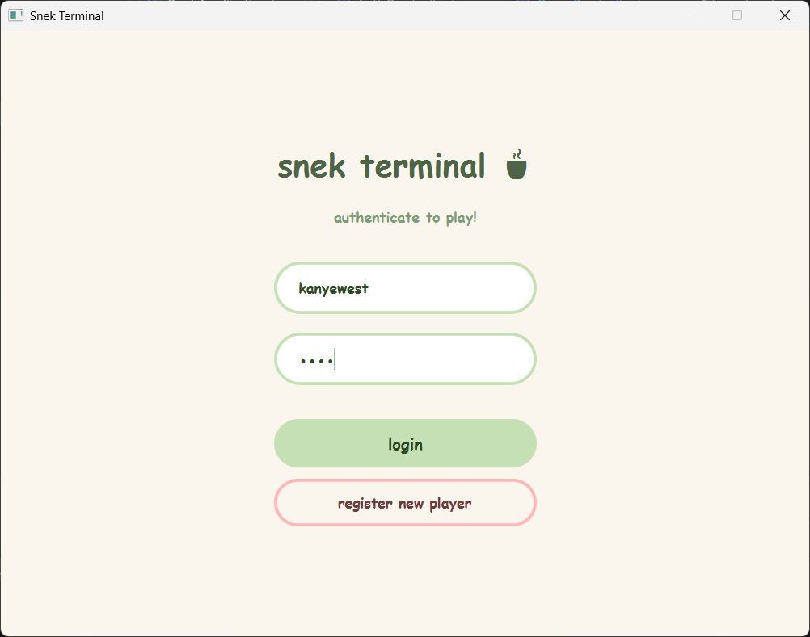
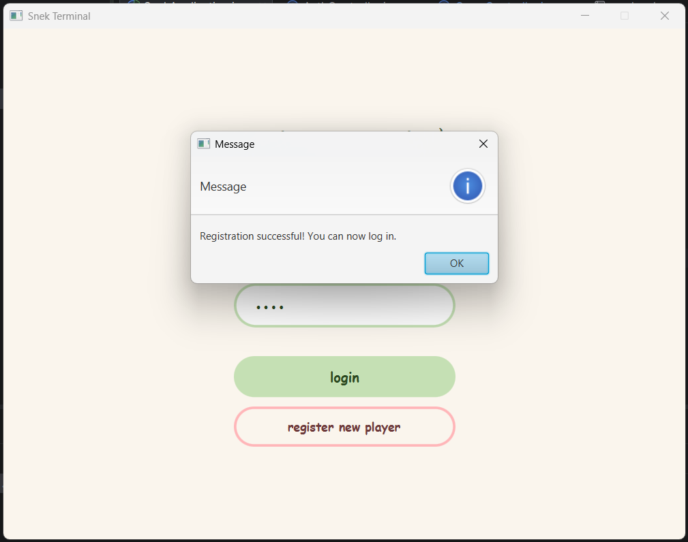
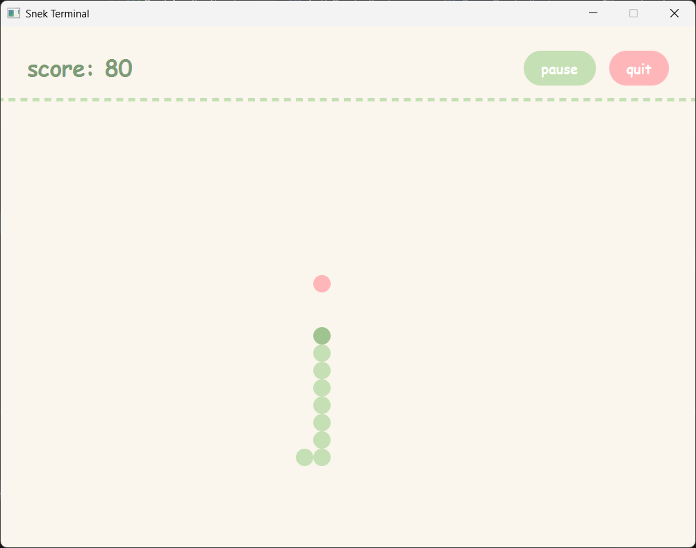
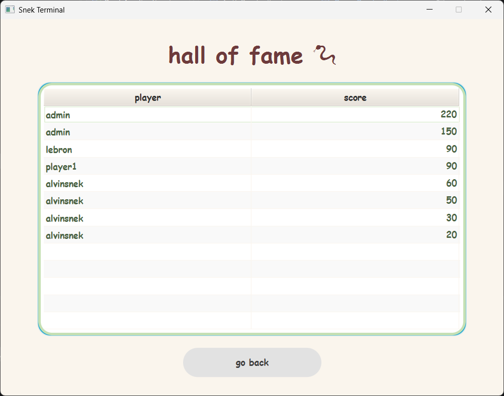

# snek :) 🐍

a cozy, snake game built with **JavaFX** and **Supabase (PostgreSQL)**.

## features
- **bubbly aesthetic**: all lowercase letters, soft pastel color palettes, and pill-shaped, fully rounded interfaces.
- **boba snek**: completely round snake segments drawn as overlapping ovals instead of classic retro blocks.
- **secure auth**: sha-256 password hashing with safe local session state control.
- **hall of fame**: real-time database pooler integration to track and render top player scores instantly.

## tech stack
- **language**: java 21 (corretto)
- **ui framework**: javafx
- **database**: supabase (postgresql)
- **build tool**: maven

## screenshots

### entry portal


### player registration


### cozy gameplay


### hall of fame


## setup

1. **clone the repository**
   ```bash
   git clone <your-repo-url>
   ```

2. **configure environment variables**
   create a `.env` file in the root directory with your supabase/postgres credentials (make sure there are no trailing spaces or quotes!):
   ```env
   DB_URL=jdbc:postgresql://your-host:6543/postgres
   DB_USER=your-user
   DB_PASSWORD=your-password
   ```

3. **run the application**
   start the app by running the `SnekApplication`